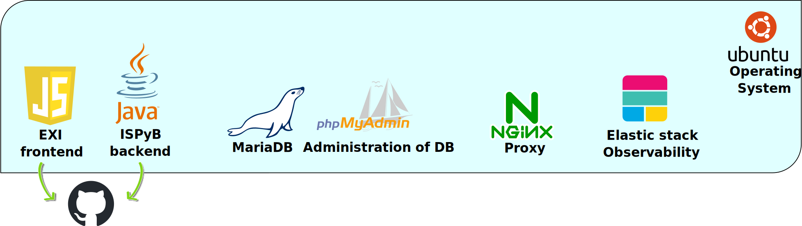

#
# ISPyB Project
**ISPyB** (Information System for Protein Crystallography Beamlines) is a laboratory information management system (LIMS) designed specifically for synchrotron facilities. 

It was originally developed to manage the data workflow and experimental processes for *macromolecular crystallography* (**MX**) experiments at synchrotrons. Over time, ISPyB has been extended to support additional experimental techniques, such as *small-angle X-ray scattering* (**SAXS**) and *cryo-electron microscopy* (**cryo-EM**).

The software provides users with a centralized system to monitor and retrieve their experimental data and results and offers administrators tools for data organization and operational oversight.

## Key Features of ISPyB
ISPyB serves as a platform for managing the experimental life cycle at synchrotron beamlines and integrates:
- Proposal and session management: tracks scientific proposals and their associated experiments, links proposals to experimental sessions, samples, and results for seamless data association.
- Sample Management: allows to register samples, including detailed metadata (chemical composition, preparation methods, barcoding).
- Container Tracking: monitors sample containers (e.g., pucks) and ensure they are properly tracked through the experiment lifecycle.
- Experimental Data Collection Management: stores metadata about experimental conditions (beamline settings, experimental parameters).
- User-Friendly Web Interface: has EXI web-based portal for users to
  - view, download, and manage their experimental data;
  - monitor beamline activity during their sessions;
  - access post-experiment results and reports.
- Security and User Management: has role-based access control and manages user accounts and permissions.

#
## Tech Stack of ISPyB project



#
## High level overview of ISPyB Deployment Architecture


ISPyB system is hosted inside a virtual machine, containing multiple components (light blue box).

External Services (yellow circles):
- *DOOR* – a proposal management system that provides data to ISPyB as well as EXI user authentication and role-base access control.
- *EDNA* – a software module for data analysis.
- *MXCUBE* – a beamline control system that interacts with ISPyB.
- *ISPYB Logistic* – a logistics module for tracking shipments and samples.

Docker Containers (marked with docker logos):
- *EXI* – a web interface for ISPyB.
- *ISPYB* – the core ISPyB application that interacts with external services.
- *DOOR2ISPYB* – a module that transfers data from DOOR to ISPyB.
- *Observability* – monitoring logs and application performance.
- *phpMyAdmin* – a web-based database management tool.
- *ISPYB DB* - the main database storing data. Periodically dumps data into ISPYB DB storage.

Networking & Security:
- *NGINX* – a reverse proxy that routes web traffic.
- *Firewall* provides security and access control.

## Getting data from User portal

## [ISPYB VM Production setup]()
* [Virtual Machine setup]()
* [Docker containers' creation]()
* [Observability for ISPyB]()
* [Security and nginx]()

## ISPYB Development setup
1. [Installing](#installing)
2. [Database creation and update](#database-creation-and-update)
3. [Database schema](#database-schema)
4. [Running with TomEE](#Project-Setup-Guide-with-TomEE-(10.x))

## Installing

1. Clone the ISPyB repository:

   ```
   git clone https://github.com/ispyb/ISPyB.git
   ```

2. ISPyB needs the third-party libraries provided in the `dependencies`
   directory.  These don't exist in a public repository, so install them to
   the local Maven repository so that Maven can find them:

   ```
   cd dependencies && mvn install
   ```

3. Build ISPyB using Maven:

   ```
   mvn clean install
   ```

   By default, ISPyB builds for the `GENERIC` site and the `development`
   environment.  These can be changed with the `ispyb.site` and `ispyb.env`
   system properties.  For example, to build for the `ESRF` site and the
   `test` environment:

   ```
   mvn -Dispyb.site=ESRF -Dispyb.env=test clean install
   ```

   If the build succeeds, a summary message will be printed like this:

   ```
   [INFO] Reactor Summary:
   [INFO]
   [INFO] ispyb-parent ...................................... SUCCESS [0.251s]
   [INFO] ispyb-ejb3 ........................................ SUCCESS [10.243s]
   [INFO] ispyb-ws .......................................... SUCCESS [1.751s]
   [INFO] ispyb-ui .......................................... SUCCESS [7.212s]
   [INFO] ispyb-ear ......................................... SUCCESS [5.048s]
   [INFO] ispyb-bcr ......................................... SUCCESS [2.217s]
   [INFO] ispyb-bcr-ear ..................................... SUCCESS [1.806s]
   ```
# Database

For development purposes and quick start up use bootstrap script in ispyb-database:

```
$> cd ispyb-database/scripts
$> ./bootstrap_db.sh
```
This will create all required users and tables in MariaDb. See the scripts file for more details.

## Database creation and update

### Prerequisites

MariaDB docker container for local development:

`docker pull mariadb:11.3-jammy`

`docker run --rm -p 3306:3306 -e  MARIADB_ROOT_PASSWORD=root --name mariadb mariadb:11.3-jammy`

`mysql` client: `sudo apt install mariadb-client`

### Create tables and schemas

Run the following creation scripts from the `ispyb-ejb` module (note
that this requires the `pxadmin` database user to exist and have full
permissions):

1. `ispyb-ejb/db/scripts/pyconfig.sql`: This corresponds to the menu
   options and contains both structure and data.

2. `ispyb-ejb/db/scripts/pydb.sql`: This corresponds to the ISPyB metadata
   and contains only the database structure.

3. `ispyb-ejb/db/scripts/schemastatus.sql`: This corresponds to the
   `SchemaStatus` table and contains both structure and data.  The entries
   indicate which update scripts have been run.

4. `ispyb-ejb/db/scripts/ispybAutoprocAttachment.sql`: This corresponds to
   the type and names of different autoPROC attachments.

The creation scripts are normally updated for each tag, but if you are
using the master branch, you may have to run the update scripts in
`ispyb-ejb/db/scripts/ahead`.

Check the entries in the `SchemaStatus` table to know which scripts
to execute.  The scripts already run for the current tag are in
`ispyb-ejb/db/scripts/passed`.

### Creating an update script

The first line must be:

```sql
insert into SchemaStatus (scriptName, schemaStatus) values ('2017_06_06_blabla.sql','ONGOING');
```

Then comes the actual updates of the script:

```sql
-- SQL statements here
```

And the last line must be:

```sql
update SchemaStatus set schemaStatus = 'DONE' where scriptName = '2017_06_06_blabla.sql';
```

The last line updates the `SchemaStatus` table to mark the script as
having been run.

## Database schema

A patch or commit that changes the database schema must be accompanied
by a corresponding change to the [schema file][schema-file]
to keep it up to date.  This file can be edited using [MySQL
Workbench][mysql-workbench] (a free tool from MySQL).

[schema-file]: https://github.com/ispyb/ISPyB/blob/master/documentation/database/ISPyB_DataModel.mwb
[mysql-workbench]: https://www.mysql.com/products/workbench/

## Project Setup Guide with TomEE (10.x)

This README provides instructions on how to set up the database connection for your project using Apache TomEE.

### Prerequisites

- Apache TomEE (configured to run your project)
- MariaDB or MySQL installed and running
- JDBC driver for MariaDB/MySQL placed in the `lib` directory of TomEE

### TomEE Configuration

1. **Datasource Configuration in `tomee.xml`**:
   - Navigate to the `conf` directory of your TomEE installation.
   - Open or create the `tomee.xml` file and add the following configuration:
     ```xml
     <Resource id="ispyb" type="DataSource">
       JdbcDriver org.mariadb.jdbc.Driver
       JdbcUrl jdbc:mariadb://localhost:3306/ispyb_build
       UserName pxuser
       Password pxuser
       JtaManaged true
     </Resource>
     ```

### Persistence Configuration

Ensure that your `persistence.xml` file is set up to use the JTA data source. Here is an example snippet:

```xml
<persistence-unit name="ispyb_db" transaction-type="JTA">
    <provider>org.apache.openjpa.persistence.PersistenceProviderImpl</provider>
    <jta-data-source>ispyb</jta-data-source>
    <properties>
        <property name="openjpa.Log" value="DefaultLevel=WARN, Runtime=INFO, Tool=INFO, SQL=TRACE"/>
    </properties>
</persistence-unit>
```

### Deployment

Build your project and deploy the resulting EAR file to TomEE.

Start or restart TomEE to pick up the new configurations.

### Using docker

For CI/CD use .docker/Dockerfile as it uses multistaged build: `docker build . -f .docker/Dockerfile`

For local development/testing use Dockerfile: `docker build .` [Optionaly provide name/tag etc]

### Troubleshooting

- Connection Issues: Ensure the database URL, username, and password are correct in tomee.xml.
- JDBC Driver: Verify that the JDBC driver for MariaDB/MySQL is correctly placed in the lib folder of your TomEE installation.
- For further assistance, consult the TomEE documentation or reach out to the community forums.

